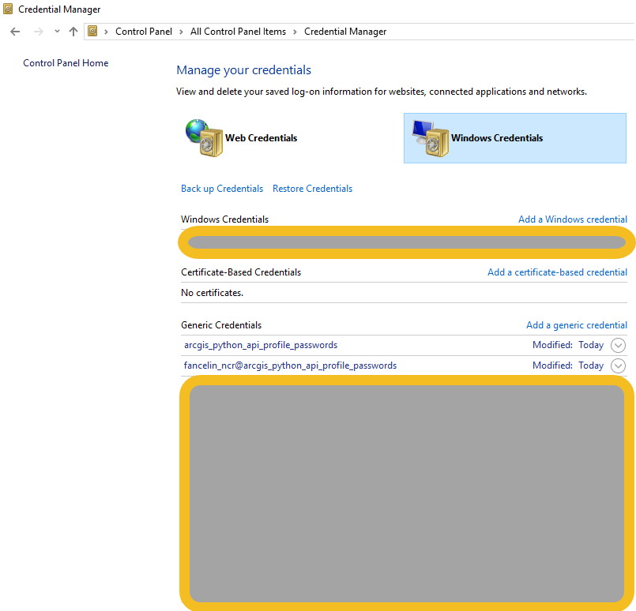
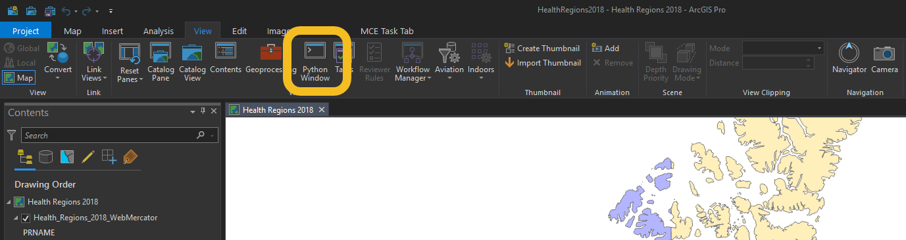

# Description

This script aims at registering your ArcGIS Online / Portal for ArcGIS with Windows Credential Manager.




This profile is generated by running the tool like that:

```Console
Welcome to this utility to create a local profile
A local profile can be used to avoid storing your ArcGIS Online / Portal credentials in clear text
Type the URL of your ArcGIS Online / Portal organization: https://esrica-ncr.maps.arcgis.com/
Your ArcGIS Portal Organization is: https://esrica-ncr.maps.arcgis.com/
Type the name of the profile that will be saved in your profile manager: fancelin_esrica_agol_profile
The profile that will be saved in your Windows Profile Manager is: fancelin_esrica_agol_profile
Profile fancelin_esrica_agol_profile does not have a password on file through keyring. If you are expecting this behavior (PKI or IWA authentication, entering password through run-time prompt, etc.), please ignore this message. If
you would like to store your password in the fancelin_esrica_agol_profile profile, run GIS(profile = 'fancelin_esrica_agol_profile', password = ...). See the API doc for more details. (http://bit.ly/2CK2wG8)
Type the ArcGIS Online / Portal user name that will be linked to this profile: fancelin_ncr
Type the password associated with user fancelin_ncr:
Storing you user name and password in your Windows Credential Manager under the profile: fancelin_esrica_agol_profile
The profile was successfully created or updated. Press any key to exit
```

You can then use that login in your application, without having to type your credentials. Just give it the profile name you just created:

```Python
   from arcgis.gis import GIS
   gis = GIS(profile='fancelin_esrica_agol_profile')
```

# Workaround for this tool

This tool achieves the same thing than running the following lines in ArcGIS Pro or Jupyter Notebook. If that's where you the most comfortable, go for it.

```python
from arcgis.gis import *
gis = GIS(url='myportalurl', username='myusername', password='mypassword', profile='myprofilename')
```

To open the Python console in ArcGIS Pro go to ArcGIS Pro's menu, go to View, and the Python console.




For more information about how to store credentials locally, please refer to the API documentation: https://developers.arcgis.com/python/guide/working-with-different-authentication-schemes/#Storing-your-credentials-locally

# Requirements

## Anaconda / ArcGIS Pro requirement

Tested with
 - Anaconda for Python 3.6 (Or the conda environment that comes with ArcGIS Pro 2.6)
 - Python API for ArcGIS 1.8.2 or higher, as a conda package
 
 The tool might work with lower version of the ArcGIS API but has not been tested.
 
 ## Python libraries for generating the documentation

Since working with ArcGIS Pro, the following API should already be installed: Python API for ArcGIS: https://developers.arcgis.com/python/

 The only additional this party library required that is needed to read the configuration file is:
 - pyyaml (https://pypi.org/project/PyYAML/): `pip install PyYAML`
 - Sphinx (https://www.sphinx-doc.org/en/master/): `pip install Sphinx`
 - Sphinx documentation theme (https://pypi.org/project/edx-sphinx-theme/) `pip install edx-sphinx-theme`
 - sphinx-autobuild
 
## Generating the documentation

### Documentation location
 
The code documentation can be generated or updated using one of the command listed below. The generated documentation
will be produced in `doc\build\index.html`

### Activate your conda environment

 - Used the quick start template: `sphinx-quickstart`
 - Theme: https://pypi.org/project/sphinx_ops_theme/
 - Build doc: `sphinx-build -b html doc/source doc/build`
 