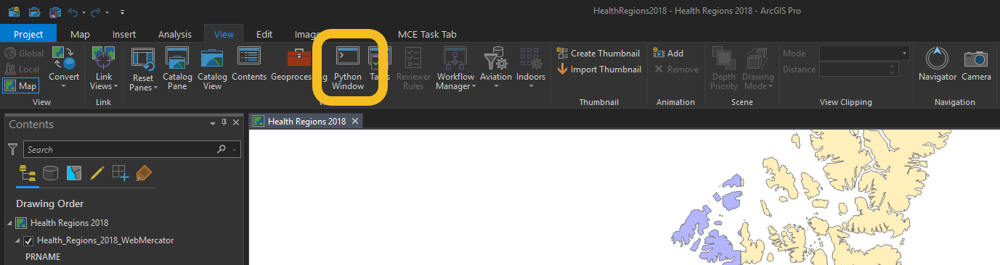

.. arcgis-api-profile-register documentation master file, created by
   sphinx-quickstart on Mon Oct  5 09:55:25 2020.
   You can adapt this file completely to your liking, but it should at least
   contain the root `toctree` directive.

Welcome to arcgis-api-profile-register's documentation!
=======================================================

.. toctree::
   :maxdepth: 2
   :caption: Contents:

Indices and tables
==================

* :ref:`genindex`
* :ref:`search`

Description
==================

This script aims at registering your ArcGIS Online / Portal for ArcGIS with Windows Credential Manager.

.. image:: images/windows_credentials.png

This profile is generated by running the tool like that:

.. code-block:: console
   :linenos:
   
	Welcome to this utility to create a local profile
	A local profile can be used to avoid storing your ArcGIS Online / Portal credentials in clear text
	Type the URL of your ArcGIS Online / Portal organization: https://esrica-ncr.maps.arcgis.com/
	Your ArcGIS Portal Organization is: https://esrica-ncr.maps.arcgis.com/
	Type the name of the profile that will be saved in your profile manager: fancelin_esrica_agol_profile
	The profile that will be saved in your Windows Profile Manager is: fancelin_esrica_agol_profile
	Profile fancelin_esrica_agol_profile does not have a password on file through keyring. If you are expecting this behavior (PKI or IWA authentication, entering password through run-time prompt, etc.), please ignore this message. If
	you would like to store your password in the fancelin_esrica_agol_profile profile, run GIS(profile = 'fancelin_esrica_agol_profile', password = ...). See the API doc for more details. (http://bit.ly/2CK2wG8)
	Type the ArcGIS Online / Portal user name that will be linked to this profile: fancelin_ncr
	Type the password associated with user fancelin_ncr:
	Storing you user name and password in your Windows Credential Manager under the profile: fancelin_esrica_agol_profile
	The profile was successfully created or updated. Press any key to exit

You can then use that login in your application, without having to type your credentials. Just give it the profile name you just created:

.. code-block:: python
   :linenos:
   
   from arcgis.gis import GIS
   gis = GIS(profile='fancelin_esrica_agol_profile')

Workaround for this tool
========================

This tool achieves the same thing than running the following lineS in ArcGIS Pro or Jupyter Notebook. If that's where you the most comfortable, go for it.

.. code-block:: python
   :linenos:

   from arcgis.gis import *
   gis = GIS(url='myportalurl', username='myusername', password='mypassword', profile='myprofilename')

To open the Python console in ArcGIS Pro go to ArcGIS Pro's menu, go to View, and the Python console.

For more information about how to store credentials locally, please refer to the API documentation: https://developers.arcgis.com/python/guide/working-with-different-authentication-schemes/#Storing-your-credentials-locally